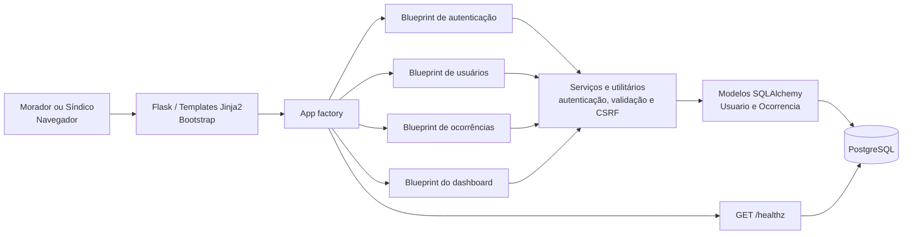
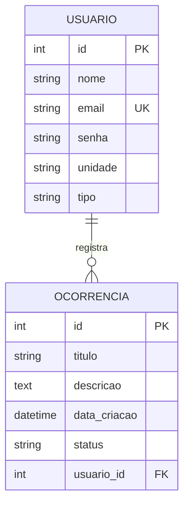

# Primeira entrega — ConectaLar

**Disciplina:** Programação Web Aplicada / Projeto de Extensão **[confirmar]**
**Instituição de ensino:** UniEvangélica **[confirmar]**
**Projeto:** ConectaLar — Sistema de Gestão Condominial
**Instituição parceira:** Condomínio Casas Flamboyant, Anápolis — GO
**Versão do documento:** 0.2
**Data:** 13/09/2026

> **Como finalizar antes do envio:** completar somente os campos marcados
> como **[confirmar]** com dados validados pelo grupo ou pela instituição. Não
> publicar telefone, endereço detalhado, senhas ou outros dados pessoais. Os
> links e as capturas solicitados nos itens 8 e 10 devem ser inseridos nos
> locais indicados depois de criados, pois o repositório local não possui remoto
> Git configurado nem acesso ao quadro externo do grupo.

## 1. Controle de versões

| Versão | Data | Responsável | Alteração | Evidência |
| --- | --- | --- | --- | --- |
| 0.1 | 13/09/2026 | Equipe ConectaLar | Registro inicial da primeira entrega: contexto, demanda, requisitos, arquitetura, backlog e planejamento. | Documento versionado no Git. |
| 0.2 | 13/09/2026 | Equipe ConectaLar | Inclusão da identificação do repositório e da evidência do commit inicial. | Seção 9 deste documento e histórico Git local. |

As próximas alterações devem acrescentar uma linha nesta tabela e ser
registradas em commit com uma mensagem que descreva objetivamente a mudança.

## 2. Identificação do projeto

| Campo | Informação |
| --- | --- |
| Projeto | ConectaLar — Sistema de Gestão Condominial |
| Alunos | Lorivan Lino de Abreu; Rafael Fortunato Rodrigues De Aquino; Stephanie Wolff Silva |
| Professor(a) responsável | **[confirmar]** |
| Disciplina | Programação Web Aplicada / Projeto de Extensão **[confirmar]** |
| Instituição de ensino | UniEvangélica **[confirmar]** |
| Instituição parceira | Condomínio Casas Flamboyant |
| Município da parceira | Anápolis — GO |
| Representante da parceira | **[confirmar]** |
| Período/semestre | **[confirmar]** |

## 3. Caracterização da instituição parceira

O Condomínio Casas Flamboyant é a entidade parceira no contexto de gestão
condominial. Sua atuação envolve organizar a convivência e os serviços comuns,
receber demandas dos moradores e encaminhá-las para acompanhamento da
administração.

No escopo deste projeto, sua missão operacional é apoiar uma comunicação
organizada, rastreável e acessível entre moradores e síndico. O público atendido
diretamente pelo sistema é formado por moradores que registram ocorrências e
pela administração/síndico, que acompanha e atualiza o andamento. Informações
institucionais que não foram validadas — como endereço, representante e contatos
— devem ser confirmadas diretamente com a parceira e mantidas fora do
repositório público quando forem dados pessoais.

## 4. Diagnóstico da demanda

Antes da solução, demandas como reclamações, solicitações e avisos tendem a
ficar dispersas em conversas e mensagens, por exemplo em grupos de WhatsApp.
Esse formato não padroniza o registro, dificulta encontrar uma solicitação
anterior, reduz a visibilidade do seu andamento e pode fazer a administração
perder contexto sobre o responsável e o status de tratamento.

O problema a ser resolvido é, portanto, a **ausência de um canal único para
registrar, consultar e acompanhar ocorrências condominiais**. O ConectaLar
centraliza esse fluxo: um usuário autenticado abre uma ocorrência com título e
descrição; o sistema a associa ao autor e a inicia como `Pendente`; o síndico
acompanha a lista e atualiza o status para `Em Andamento` ou `Resolvido`.

**Resultado esperado:** reduzir a dependência de mensagens dispersas, dar
transparência ao acompanhamento das solicitações e oferecer à administração um
painel com busca, filtros, paginação e indicadores por status. Esse é um impacto
esperado do MVP; sua confirmação deve ocorrer em validação posterior com a
instituição parceira.

## 5. Infraestrutura tecnológica da instituição

O levantamento abaixo separa o que é conhecido da aplicação do que ainda exige
vistoria. Nenhum item marcado como pendente deve ser apresentado como recurso
confirmado.

| Recurso | Situação para o MVP | Uso na implantação | Validação pendente |
| --- | --- | --- | --- |
| Computador com navegador atualizado | Necessário; quantidade e especificações **[confirmar]** | Acesso do síndico e moradores à interface web. | Confirmar equipamentos disponíveis e sistema operacional. |
| Conexão com internet | Necessária; velocidade e estabilidade **[confirmar]** | Acesso à aplicação hospedada ou ao servidor local. | Testar conectividade no local. |
| Servidor de aplicação | Pode ser hospedagem compatível com Python/Gunicorn; provedor **[confirmar]** | Executar Flask em produção. | Definir responsável, domínio, backup e monitoramento. |
| Banco de dados | PostgreSQL é o banco-alvo do projeto. | Persistir usuários e ocorrências. | Definir instância, credenciais seguras e política de backup. |
| Rede local/impressora | Fora do escopo do MVP, salvo necessidade confirmada. | Não é requisito para o fluxo web. | Registrar apenas se a instituição exigir. |

Para o desenvolvimento e os testes, o projeto utiliza Python, Flask e uma base
SQLite em memória na suíte automatizada. Para implantação, a configuração é
realizada por variáveis de ambiente; `SECRET_KEY` é obrigatória em produção e
as credenciais não devem ser versionadas.

## 6. Levantamento de requisitos

### 6.1 Stakeholders

| Parte interessada | Interesse/necessidade | Participação no projeto |
| --- | --- | --- |
| Moradores | Registrar e consultar ocorrências de forma simples. | Usuários finais e fonte de feedback de usabilidade. |
| Síndico/administração | Visualizar demandas, cadastrar usuários e atualizar o andamento. | Usuário administrativo e validador do fluxo. |
| Instituição parceira | Melhorar a organização da comunicação condominial. | Beneficiária e fonte de contexto para validação. |
| Equipe discente | Desenvolver, testar, documentar e manter o MVP. | Responsável pela implementação e evidências. |
| Professor(a) | Acompanhar aderência acadêmica e técnica da entrega. | Avaliação e orientação. |

### 6.2 Requisitos funcionais

| ID | Requisito | Prioridade |
| --- | --- | --- |
| RF01 | O sistema deve permitir que usuários cadastrados façam login e encerrem a sessão. | Alta |
| RF02 | O sistema deve diferenciar os perfis `morador` e `síndico`. | Alta |
| RF03 | O síndico deve poder cadastrar e listar usuários, com nome, e-mail, senha, unidade e tipo de usuário. | Alta |
| RF04 | Todo usuário autenticado deve poder abrir uma ocorrência com título e descrição. | Alta |
| RF05 | O sistema deve associar a ocorrência ao usuário autor e defini-la inicialmente como `Pendente`. | Alta |
| RF06 | O síndico deve poder atualizar o status de uma ocorrência para `Pendente`, `Em Andamento` ou `Resolvido`. | Alta |
| RF07 | O dashboard deve listar ocorrências, exibir contadores e permitir busca, filtro por status e paginação. | Média |
| RF08 | O sistema deve disponibilizar um endpoint de saúde para verificar aplicação e banco. | Média |

### 6.3 Requisitos não funcionais

| ID | Requisito | Critério de aceite inicial |
| --- | --- | --- |
| RNF01 | Segurança de autenticação | Senhas armazenadas com hash; rotas protegidas exigem sessão. |
| RNF02 | Autorização | Apenas síndico acessa cadastro/listagem de usuários e alteração de status. |
| RNF03 | Integridade das requisições | Operações mutáveis devem usar proteção CSRF. |
| RNF04 | Confiabilidade | Dados válidos devem persistir; falhas de banco devem acionar rollback nas operações críticas. |
| RNF05 | Usabilidade | Interface responsiva deve permitir o fluxo principal em navegador, com mensagens de validação. |
| RNF06 | Desempenho | Em ambiente de teste, o dashboard e o registro de ocorrência devem ter P95 de até 2 s em medição controlada. |
| RNF07 | Manutenibilidade | Código organizado em app factory, blueprints por domínio, serviços e testes pytest executáveis em comando único. |
| RNF08 | Configuração | Produção deve receber segredos e conexão de banco por variáveis de ambiente; nenhum segredo é versionado. |

## 7. Proposta de solução

O ConectaLar é um sistema web para gestão de ocorrências condominiais. Seu
objetivo é estruturar a comunicação entre moradores e administração em um fluxo
único e persistente. Os usuários do MVP são os moradores autenticados e o
síndico, com permissões distintas.

**Escopo do MVP:** autenticação, gestão básica de usuários pelo síndico,
abertura de ocorrências, atualização de status pelo síndico e dashboard com
consulta, busca, filtro, paginação e indicadores. **Fora do escopo inicial:**
anexos, notificações, comentários, recuperação automática de senha, API pública,
relatórios analíticos e suporte a múltiplos condomínios.

## 8. Gestão do backlog (Trello)

**Link do quadro:** **[inserir URL pública ou URL acessível ao professor]**

Colunas recomendadas: **Backlog → Sprint atual → Em desenvolvimento → Em
teste → Concluído**. Cada card deve conter descrição, responsável, prioridade,
critério de aceite, requisito relacionado e link do commit/evidência.

| Card inicial | Requisito | Prioridade | Critério de conclusão |
| --- | --- | --- | --- |
| B-01 — Validar dados da instituição e infraestrutura | Contexto / RNF08 | Alta | Campos pendentes confirmados ou limitação registrada. |
| B-02 — Configurar autenticação e perfis | RF01, RF02, RNF01, RNF02 | Alta | Login e restrições por perfil testados. |
| B-03 — Gestão de usuários | RF03 | Alta | Síndico cadastra/lista usuários com validações. |
| B-04 — Registro de ocorrências | RF04, RF05, RNF04 | Alta | Ocorrência válida persiste com autor e status inicial. |
| B-05 — Atualização de status | RF06, RNF02 | Alta | Apenas síndico altera status permitido; regressão aprovada. |
| B-06 — Dashboard e consulta | RF07, RNF05 | Média | Busca, filtro, paginação e contadores funcionam. |
| B-07 — Segurança e validações | RNF01 a RNF04 | Alta | CSRF, erros e cenários não autorizados cobertos. |
| B-08 — Documentação e evidências | RNF07, RNF08 | Média | README, histórico Git e capturas atualizados. |

**Capturas a anexar:**

1. `docs/evidencias/primeira-entrega/01-quadro-inicial.png` — quadro com as
   colunas e os cards iniciais;
2. `docs/evidencias/primeira-entrega/02-card-detalhado.png` — exemplo de card
   com responsável, prioridade e critério de aceite.

Antes de anexar, revise as imagens para ocultar e-mails, telefones, tokens e
informações pessoais.

## 9. Repositório do Projeto (Git)

O código-fonte, os testes e a documentação do ConectaLar são mantidos em um
repositório Git. O versionamento permite identificar quem realizou cada
alteração, recuperar versões anteriores e relacionar as entregas aos itens do
backlog. Nenhuma credencial, arquivo `.env` real ou dado pessoal deve ser
enviado ao repositório.

### 9.1 Identificação e Compartilhamento

| Campo | Informação |
| --- | --- |
| Nome do repositório | `conectalar` |
| Sistema de controle de versão | Git |
| Branch de trabalho registrada nesta entrega | `work` |
| URL do repositório remoto | **[inserir URL após publicar o repositório]** |
| Forma de compartilhamento | Conceder acesso ao professor e aos integrantes da equipe pelo provedor Git escolhido; se o repositório for privado, enviar convite ou link com permissão de leitura. |
| Conteúdo versionado | Código da aplicação, testes, documentação e evidências que não contenham dados sensíveis. |

No momento da elaboração desta versão, o clone local não possui um remoto Git
configurado. Antes da entrega, a equipe deve publicar o repositório em uma
plataforma como GitHub, GitLab ou Bitbucket, inserir a URL acima e verificar que
o professor consegue abrir o histórico e os arquivos. Para conferir a
configuração e o compartilhamento, executar:

```bash
git remote -v
git branch --show-current
git log --oneline --decorate -10
```

### 9.2 Histórico de Commits

O histórico do projeto registra a evolução do MVP, incluindo a estrutura
inicial, as melhorias de organização, testes e documentação. As mensagens de
commit devem ser objetivas, descrever a alteração entregue e, quando aplicável,
referenciar o card do backlog ou o requisito atendido. Commits de merge fazem
parte do histórico de integração e não substituem os commits que implementam a
alteração.

A consulta do histórico completo pode ser feita com:

```bash
git log --oneline --decorate --all
```

#### 9.2.1 Commit Inicial

| Campo | Registro |
| --- | --- |
| Hash completo | `d5333f63fc84f6fad5fdfb778b18a4b13a4ee9b3` |
| Hash abreviado | `d5333f6` |
| Data | 15/04/2026 |
| Autor | Lorivan Lino Abreu |
| Mensagem | `MVP ConectaLar - Versão Funcional Completa` |
| Conteúdo entregue | Estrutura inicial da aplicação Flask, modelos, rotas, templates, configuração, dependências e script de criação de usuário. |

Esse commit estabelece a linha de base funcional do ConectaLar. A evidência
pode ser reproduzida no terminal com o comando abaixo, que exibe os metadados e
os arquivos incluídos na primeira versão:

```bash
git show --stat --format=fuller d5333f63fc84f6fad5fdfb778b18a4b13a4ee9b3
```

## 10. Arquitetura da solução

O sistema segue uma arquitetura web em camadas. A aplicação Flask é criada por
uma *app factory*, distribui as rotas por blueprints de domínio e usa modelos
SQLAlchemy para persistir dados no PostgreSQL. Serviços concentram validações e
regras de negócio; utilitários tratam autenticação, sessão, CSRF e datas.





```bash
git log --oneline --decorate -10
```

## 11. Planejamento das sprints

As sprints têm duração de duas semanas. A data de início de cada ciclo deve ser
ajustada ao calendário da disciplina e registrada no Trello e nesta tabela.

| Sprint | Duração | Objetivo | Entregáveis e evidências |
| --- | --- | --- | --- |
| Sprint 1 — Descoberta e base | Semanas 1–2 | Confirmar instituição, infraestrutura, problema, requisitos e backlog. | Documento v0.1, quadro inicial, diagrama e histórico Git. |
| Sprint 2 — Fluxo principal | Semanas 3–4 | Implementar/validar login, perfis, usuários e abertura de ocorrências. | Cards concluídos, commits e testes dos fluxos críticos. |
| Sprint 3 — Gestão e consulta | Semanas 5–6 | Implementar/validar atualização de status e dashboard. | Demonstração do painel, testes de autorização e evidências de persistência. |
| Sprint 4 — Qualidade e entrega | Semanas 7–8 | Executar regressão, revisar segurança/usabilidade e consolidar a entrega. | Suíte pytest, evidências finais, retrospectiva e documentação atualizada. |

### Definição de pronto por sprint

Um item só é considerado concluído quando: (1) atende ao critério de aceite;
(2) possui teste ou roteiro de verificação executado; (3) foi revisado pela
equipe; (4) está vinculado a commit e card do Trello; e (5) não expõe dados
pessoais ou credenciais nas evidências.

## 12. Próximas ações

1. Confirmar nome do professor, disciplina, período, representante e recursos
   tecnológicos com as fontes adequadas.
2. Criar o quadro Trello, cadastrar os cards B-01 a B-08 e inserir o link neste
   documento.
3. Criar as capturas indicadas na seção 8 e no repositório, usando dados
   fictícios quando necessário.
4. Definir as datas reais das sprints quinzenais e os responsáveis por cada
   card.
5. Executar a suíte de testes antes de cada encerramento de sprint e registrar
   resultados relevantes no quadro e no Git.
